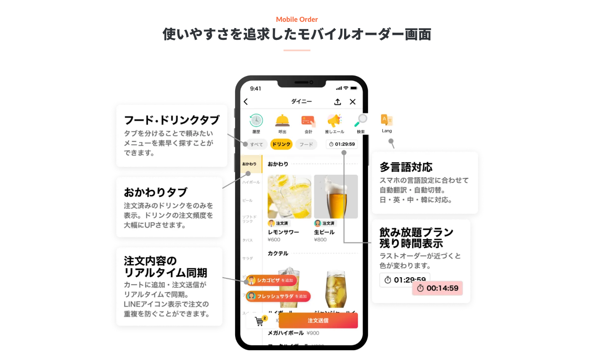

最近居酒屋に行くと、卓上にQRコードが書かれた紙が置いてあり、そこから注文することがとても増えましたよね〜🤔
私はお酒が大好きで居酒屋によく行くので、モバイルオーダーには非常にお世話になっていますw！

最近は色々な会社がモバイルオーダーサービスを提供していますが、個人的には [dinii](https://www.dinii.jp/#feature_mobileorder)のアプリがイチオシです！
注文しやすいのはもちろん、おかわりまでの導線が分かりやすかったり、飲み放題の残り時間が分かったりと良いUXだな〜と毎回思っています

画像は [dinii](https://www.dinii.jp/#feature_mobileorder) の公式サイトより引用。お世話になってます！

でも毎回カメラを出してQRコードを読み取るのは面倒...。特に酔ってる時は余計にw

そこで一回読み取ったQRコードをアプリに保存して、次からは履歴から再度URLを開くことができたら便利じゃないかな〜と思い、新アプリ「QR History」を作成しました！

この feature Imageはcanvaでデザインセンスないなりに作成しました...デザインむずい。

このアプリは非常にシンプルで、読み取ったQRコードをリスト形式でローカルに保存します。削除もできますし、共有も可能です！
仲間内で使うと、誰かが読み取ったQRコードをグループなどに共有することができるので、わざわざQRコードを回さなくても大丈夫です！
またAndroid, iOSの両方に対応しています！

居酒屋で大活躍間違いなし！w同じような悩みを持っている方に使っていただけたら嬉しいです！

## 開発情報

- 開発期間：約二週間
  - 半分くらいChatGPT君が書いてくれた...優秀...🥺
- フレームワーク：Flutter
  - 超久しぶり(二年ぶり)にアプリ作った。Flutterの練度上げたい。

## リンク（公開したら更新します）

- Android: [Google Play Store]()
- iOS: [App Store]()
- 問い合わせ: [Google form]()
